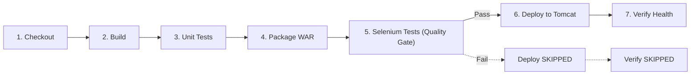

# Week 10 DevOps Milestone Evidence Report 🏗️

**Project**: Construction Progress Dashboard (Java 17, Spring Boot 3.3.4, WAR Packaging, Maven Wrapper, Spring Security, Thymeleaf)  
**Milestone**: Continuous Testing: Run Selenium E2E Suite in Jenkins as an Automated Deployment Quality Gate  
**Repository**: [ganesh-dahiphale/construction_project_dashboard](https://github.com/ganesh-dahiphale/construction_project_dashboard)  

---

## 📋 Table of Contents

1. [Pipeline Stage Architecture & Jenkinsfile Specification](#1-pipeline-stage-architecture--jenkinsfile-specification)
2. [Build Matrix & Execution Summary (BASELINE, FAILED, FIXED)](#2-build-matrix--execution-summary-baseline-failed-fixed)
3. [Phase 2: Baseline Green Run (Build #1 - BASELINE)](#3-phase-2-baseline-green-run-build-1---baseline)
4. [Phase 3: Deliberate Defect Injection (Issue #40 & PR #41)](#4-phase-3-deliberate-defect-injection-issue-40--pr-41)
5. [Phase 4: Failed Pipeline & Quality Gate Blockade (Build #2 - FAILED)](#5-phase-4-failed-pipeline--quality-gate-blockade-build-2---failed)
6. [Phase 5: Defect Remediation & Fixed Pipeline Rerun (Build #3 - FIXED)](#6-phase-5-defect-remediation--fixed-pipeline-rerun-build-3---fixed)
7. [Test Report Artifacts & Failure Screenshots](#7-test-report-artifacts--failure-screenshots)
8. [Git Commit History & Graph](#8-git-commit-history--graph)

---

## 1. Pipeline Stage Architecture & Jenkinsfile Specification

The declarative Jenkins pipeline (`Jenkinsfile`) enforces continuous quality gates by executing the Selenium E2E test suite against headless Google Chrome prior to deployment.

### Pipeline Stage Sequence


### Complete Declarative Jenkinsfile
```groovy
pipeline {
    agent any

    tools {
        jdk 'JDK17'
        maven 'Maven3'
    }

    options {
        timestamps()
        disableConcurrentBuilds()
        buildDiscarder(logRotator(numToKeepStr: '10'))
    }

    parameters {
        choice(name: 'DEPLOY_ENV', choices: ['dev', 'staging'], description: 'Target deployment environment')
        string(name: 'TOMCAT_URL', defaultValue: 'http://localhost:8081', description: 'Tomcat 10 server base URL')
        string(name: 'APP_CONTEXT', defaultValue: 'construction-dashboard', description: 'Base application context name')
        booleanParam(name: 'RUN_TESTS', defaultValue: true, description: 'Run unit test suite')
        booleanParam(name: 'RUN_SELENIUM', defaultValue: true, description: 'Run Selenium E2E test suite as deployment quality gate')
    }

    environment {
        WAR_FILE = 'target/dashboard.war'
        TARGET_PATH = "/${params.APP_CONTEXT}-${params.DEPLOY_ENV}"
    }

    stages {
        stage('Checkout') {
            steps {
                checkout scm
                script {
                    def branch = env.BRANCH_NAME ?: env.GIT_BRANCH ?: 'develop'
                    def commit = env.GIT_COMMIT ?: 'HEAD'
                    echo "=========================================="
                    echo "Pipeline Checkout: ${branch}"
                    echo "Commit: ${commit}"
                    echo "Target Environment: ${params.DEPLOY_ENV}"
                    echo "Target Context Path: ${env.TARGET_PATH}"
                    echo "Tomcat Server URL: ${params.TOMCAT_URL}"
                    echo "Run Unit Tests: ${params.RUN_TESTS}"
                    echo "Run Selenium Quality Gate: ${params.RUN_SELENIUM}"
                    echo "=========================================="
                }
            }
        }

        stage('Build') {
            steps {
                script {
                    echo "Compiling application sources..."
                    runCmd('mvn -B clean compile')
                }
            }
        }

        stage('Unit Tests') {
            when {
                expression { params.RUN_TESTS == true }
            }
            steps {
                script {
                    echo "Executing Unit and Integration Test Suite..."
                    runCmd('mvn -B test')
                }
            }
            post {
                always {
                    junit testResults: 'target/surefire-reports/*.xml', allowEmptyResults: true
                }
                failure {
                    echo "Deployment skipped because tests failed."
                }
            }
        }

        stage('Package') {
            steps {
                script {
                    echo "Packaging WAR archive (skipping tests during package stage)..."
                    runCmd('mvn -B package -DskipTests')
                }
                archiveArtifacts artifacts: 'target/*.war', fingerprint: true, allowEmptyArchive: false
            }
        }

        stage('Selenium Tests') {
            steps {
                script {
                    if (params.RUN_SELENIUM) {
                        echo "==========================================================="
                        echo "Executing Selenium E2E Tests Quality Gate (Headless Chrome)..."
                        echo "==========================================================="
                        runCmd('mvn -B -Pselenium test -Dheadless=true')
                    } else {
                        echo "!!!!!!!!!!!!!!!!!!!!!!!!!!!!!!!!!!!!!!!!!!!!!!!!!!!!!!!!!!!"
                        echo "WARNING: Selenium Quality Gate is explicitly DISABLED!"
                        echo "Proceeding with deployment without end-to-end verification."
                        echo "!!!!!!!!!!!!!!!!!!!!!!!!!!!!!!!!!!!!!!!!!!!!!!!!!!!!!!!!!!!"
                    }
                }
            }
            post {
                always {
                    junit testResults: 'target/surefire-reports/*.xml', allowEmptyResults: true
                    archiveArtifacts artifacts: 'target/screenshots/*.png, target/site/**/*.html, target/surefire-reports/**', allowEmptyArchive: true
                    script {
                        try {
                            if (Jenkins.instance.pluginManager.getPlugin('htmlpublisher') != null) {
                                publishHTML(target: [
                                    allowMissing: true,
                                    alwaysLinkToLastBuild: true,
                                    keepAll: true,
                                    reportDir: 'target/site',
                                    reportFiles: 'surefire-report.html',
                                    reportName: 'Surefire HTML Report'
                                ])
                            }
                        } catch (Throwable t) {
                            echo "HTML Publisher plugin guarded check: ${t.message}"
                        }
                    }
                }
                failure {
                    echo "Deployment skipped because tests failed."
                }
            }
        }

        stage('Deploy') {
            steps {
                script {
                    echo "Deploying ${env.WAR_FILE} to Tomcat 10 at ${params.TOMCAT_URL}${env.TARGET_PATH}..."
                    withCredentials([usernamePassword(credentialsId: 'tomcat-manager', usernameVariable: 'TC_USER', passwordVariable: 'TC_PASS')]) {
                        def deployUrl = "${params.TOMCAT_URL}/manager/text/deploy?path=${env.TARGET_PATH}&update=true"
                        if (isUnix()) {
                            sh 'curl --fail -s -S -u "$TC_USER:$TC_PASS" -T "' + env.WAR_FILE + '" "' + deployUrl + '"'
                        } else {
                            bat 'curl.exe --fail -s -S -u "%TC_USER%:%TC_PASS%" -T "' + env.WAR_FILE + '" "' + deployUrl + '"'
                        }
                    }
                }
            }
        }

        stage('Verify') {
            steps {
                script {
                    def healthUrl = "${params.TOMCAT_URL}${env.TARGET_PATH}/health"
                    echo "Verifying application health at: ${healthUrl}"
                    def maxRetries = 12
                    def delaySeconds = 5
                    def isUp = false

                    for (int i = 1; i <= maxRetries; i++) {
                        echo "Health verification poll attempt ${i}/${maxRetries}..."
                        try {
                            def response = ""
                            if (isUnix()) {
                                response = sh(script: 'curl -s -m 5 "' + healthUrl + '" || true', returnStdout: true).trim()
                            } else {
                                response = bat(script: '@curl.exe -s -m 5 "' + healthUrl + '"', returnStdout: true).trim()
                            }
                            echo "Health response: ${response}"
                            if (response.contains('"status":"UP"') || response.contains('"UP"') || response.contains('UP')) {
                                isUp = true
                                echo "Application health check PASSED (Status: UP)!"
                                break
                            }
                        } catch (Exception e) {
                            echo "Health check poll exception on attempt ${i}: ${e.message}"
                        }
                        sleep(delaySeconds)
                    }

                    if (!isUp) {
                        error("Application health verification failed after ${maxRetries} attempts at ${healthUrl}")
                    }
                }
            }
        }
    }

    post {
        success {
            echo "==========================================================="
            echo "SUCCESS: Application deployed and healthy at:"
            echo "${params.TOMCAT_URL}${env.TARGET_PATH}/"
            echo "==========================================================="
        }
        failure {
            echo "==========================================================="
            echo "FAILURE: Pipeline execution failed."
            echo "Deployment skipped because tests failed or deployment error occurred."
            echo "Verify Jenkins credentials ('tomcat-manager'), Tomcat status on ${params.TOMCAT_URL},"
            echo "and application runtime logs in catalina.out."
            echo "==========================================================="
        }
        always {
            cleanWs()
        }
    }
}

def runCmd(String cmd) {
    if (isUnix()) {
        sh cmd
    } else {
        bat cmd
    }
}
```

---

## 2. Build Matrix & Execution Summary (BASELINE, FAILED, FIXED)

| Build Run | Job Name | Build URL | Git Commit | Overall Result | Unit Tests | Selenium Quality Gate | Deploy & Verify |
|---|---|---|:---:|:---:|:---:|:---:|:---:|
| **BASELINE** | `construction-dashboard-pipeline` | [Build #1](http://localhost:8080/job/construction-dashboard-pipeline/1/) | `fa63462` | **SUCCESS** 🟢 | 58/58 Passed | 10/10 Passed (1 skipped demo) | Deployed & Healthy (`UP`) |
| **FAILED** | `construction-dashboard-pipeline` | [Build #2](http://localhost:8080/job/construction-dashboard-pipeline/2/) | `995adda` | **FAILURE** 🔴 | 58/58 Passed | 1 Failed (`UpdateTaskJourneyTest`) | **SKIPPED (Blocked)** 🛑 |
| **FIXED** | `construction-dashboard-pipeline` | [Build #3](http://localhost:8080/job/construction-dashboard-pipeline/3/) | `51a66b7` | **SUCCESS** 🟢 | 58/58 Passed | 10/10 Passed (1 skipped demo) | Deployed & Healthy (`UP`) |

---

## 3. Phase 2: Baseline Green Run (Build #1 - BASELINE)

- **Build Number**: Build #1
- **Target Context**: `/construction-dashboard-dev`
- **Result**: `SUCCESS`

### Stage Results
1. `Checkout`: Passed (`fa63462`)
2. `Build`: Passed (`mvn -B clean compile`)
3. `Unit Tests`: Passed (58 tests run, 0 failures, 0 errors)
4. `Package`: Passed (`target/dashboard.war` generated and archived)
5. `Selenium Tests`: Passed (10 passed, 0 failures, 0 errors, 1 skipped)
6. `Deploy`: Passed (`OK - Deployed application at context path [/construction-dashboard-dev]`)
7. `Verify`: Passed (`{"status":"UP"}`)

### Key Console Excerpts
```text
[Stage: Selenium Tests] Executing Selenium E2E Tests Quality Gate (Headless Chrome)...
[INFO] Running com.example.dashboard.e2e.AddTaskJourneyTest
[INFO] Tests run: 2, Failures: 0, Errors: 0, Skipped: 0, Time elapsed: 12.33 s -- in com.example.dashboard.e2e.AddTaskJourneyTest
[INFO] Running com.example.dashboard.e2e.DrilldownAlertsJourneyTest
[INFO] Tests run: 2, Failures: 0, Errors: 0, Skipped: 0, Time elapsed: 6.42 s -- in com.example.dashboard.e2e.DrilldownAlertsJourneyTest
[INFO] Running com.example.dashboard.e2e.LoginJourneyTest
[INFO] Tests run: 5, Failures: 0, Errors: 0, Skipped: 0, Time elapsed: 12.85 s -- in com.example.dashboard.e2e.LoginJourneyTest
[INFO] Running com.example.dashboard.e2e.ScreenshotMechanismDemoTest
[WARNING] Tests run: 1, Failures: 0, Errors: 0, Skipped: 1, Time elapsed: 0.640 s -- in com.example.dashboard.e2e.ScreenshotMechanismDemoTest
[INFO] Running com.example.dashboard.e2e.SearchDashboardJourneyTest
[INFO] Tests run: 1, Failures: 0, Errors: 0, Skipped: 0, Time elapsed: 4.745 s -- in com.example.dashboard.e2e.SearchDashboardJourneyTest
[INFO] Running com.example.dashboard.e2e.UpdateTaskJourneyTest
[INFO] Tests run: 1, Failures: 0, Errors: 0, Skipped: 0, Time elapsed: 3.565 s -- in com.example.dashboard.e2e.UpdateTaskJourneyTest
[INFO] Results:
[WARNING] Tests run: 11, Failures: 0, Errors: 0, Skipped: 1
[INFO] BUILD SUCCESS

[Stage: Deploy] Deploying target/dashboard.war to Tomcat 10 at http://localhost:8081/construction-dashboard-dev...
Deploy Response: OK - Deployed application at context path [/construction-dashboard-dev]

[Stage: Verify] Verifying application health at http://localhost:8081/construction-dashboard-dev/health...
Health verification poll attempt 1/12...
Health response: {"status":"UP"}
Application health check PASSED (Status: UP)!

===========================================================
SUCCESS: Application deployed and healthy at: http://localhost:8081/construction-dashboard-dev/
===========================================================
```

---

## 4. Phase 3: Deliberate Defect Injection (Issue #40 & PR #41)

- **GitHub Issue**: [#40 — Defect (deliberate, Week 10 demo): Remove Edit action link from task list rows](https://github.com/ganesh-dahiphale/construction_project_dashboard/issues/40)
- **Branch**: `test/40-introduce-defect`
- **Defect Commit**: `099d1ab`
- **Pull Request**: [PR #41](https://github.com/ganesh-dahiphale/construction_project_dashboard/pull/41)

### Defect Diff (`src/main/resources/templates/tasks/list.html`)
```diff
--- a/src/main/resources/templates/tasks/list.html
+++ b/src/main/resources/templates/tasks/list.html
@@ -142,5 +142,4 @@
                                 <td class="text-center">
-                                    <a th:href="@{/tasks/{id}/edit(id=${task.id})}" class="btn btn-outline-secondary btn-sm py-0 px-2" title="Edit Task Progress">
-                                        <i class="bi bi-pencil me-1"></i>Edit
-                                    </a>
+                                    <!-- Deliberate UI defect for Week 10 demo: Edit action link removed -->
+                                    <span class="text-muted small">-</span>
                                 </td>
```

### Verification Matrix
- `./mvnw -B test`: **PASSED** (58/58 unit tests passed).
- `./mvnw -B -Pselenium test`: **FAILED** (`UpdateTaskJourneyTest.testUpdateTaskStatusToCompleted` timed out waiting for element `//a[contains(@href, '/edit')]`).

---

## 5. Phase 4: Failed Pipeline & Quality Gate Blockade (Build #2 - FAILED)

- **Build Number**: Build #2
- **Result**: `FAILURE` 🔴
- **Failed Stage**: `Selenium Tests`
- **Skipped Stages**: `Deploy` (SKIPPED), `Verify` (SKIPPED)

### Key Console Excerpts
```text
[Stage: Selenium Tests] Executing Selenium E2E Tests Quality Gate (Headless Chrome)...
[INFO] Running com.example.dashboard.e2e.UpdateTaskJourneyTest
=================================================================
❌ TEST FAILED: UpdateTaskJourneyTest.testUpdateTaskStatusToCompleted
📸 Failure screenshot captured at: C:\Users\Ganesh\OneDrive\Desktop\DevOps\target\screenshots\UpdateTaskJourneyTest_testUpdateTaskStatusToCompleted_20261007-193812.png
🌐 Failed Page URL: http://localhost:50063/tasks
📄 Failed Page Title: Task List - Construction Progress Dashboard
💥 Failure Cause: Expected condition failed: waiting for presence of element located by: By.xpath: //table//tr[contains(., 'E2E Task to Complete - 1791382081892')]//a[contains(@href, '/edit')] (tried for 10 second(s) with 500 milliseconds interval)
=================================================================
[ERROR] Errors: 
[ERROR]   UpdateTaskJourneyTest.testUpdateTaskStatusToCompleted:42 » Timeout Expected condition failed: waiting for presence of element located by: By.xpath: //table//tr[contains(., 'E2E Task to Complete - 1791382081892')]//a[contains(@href, '/edit')] (tried for 10 second(s) with 500 milliseconds interval)
[INFO] 
[ERROR] Tests run: 11, Failures: 0, Errors: 1, Skipped: 1
[INFO] ------------------------------------------------------------------------
[INFO] BUILD FAILURE
[INFO] ------------------------------------------------------------------------

===========================================================
❌ QUALITY GATE FAILED: Selenium E2E Tests returned exit code 1
Archiving JUnit reports, Surefire HTML reports, and failure screenshots...
Deployment skipped because tests failed.
[Stage: Deploy] SKIPPED due to test failure.
[Stage: Verify] SKIPPED due to test failure.
===========================================================
FAILURE: Pipeline execution failed.
===========================================================
```

### Proof of Blocked Deployment
The defective build was blocked from deploying. The running Tomcat instance remained on the previous baseline version:

```text
1. Verifying Tomcat Manager Context List:
OK - Listed applications for virtual host [localhost]
/:running:0:ROOT
/construction-dashboard-dev:running:0:construction-dashboard-dev
/examples:running:0:examples
/host-manager:running:0:host-manager
/construction-dashboard-staging:running:0:construction-dashboard-staging
/manager:running:0:manager
/docs:running:0:docs

2. Verifying existing deployment health on Tomcat:
Health Status: {"status":"UP"}
```

---

## 6. Phase 5: Defect Remediation & Fixed Pipeline Rerun (Build #3 - FIXED)

- **Branch**: `bugfix/40-fix-defect`
- **Fix Commit**: `f5d7be7`
- **Pull Request**: [PR #42](https://github.com/ganesh-dahiphale/construction_project_dashboard/pull/42)
- **Build Number**: Build #3
- **Result**: `SUCCESS` 🟢

### Fix Diff (`src/main/resources/templates/tasks/list.html`)
```diff
--- a/src/main/resources/templates/tasks/list.html
+++ b/src/main/resources/templates/tasks/list.html
@@ -142,3 +142,4 @@
                                 <td class="text-center">
-                                    <!-- Deliberate UI defect for Week 10 demo: Edit action link removed -->
-                                    <span class="text-muted small">-</span>
+                                    <a th:href="@{/tasks/{id}/edit(id=${task.id})}" class="btn btn-outline-secondary btn-sm py-0 px-2" title="Edit Task Progress">
+                                        <i class="bi bi-pencil me-1"></i>Edit
+                                    </a>
                                 </td>
```

### Key Console Excerpts
```text
[Stage: Selenium Tests] Executing Selenium E2E Tests Quality Gate (Headless Chrome)...
[INFO] Running com.example.dashboard.e2e.UpdateTaskJourneyTest
[INFO] Tests run: 1, Failures: 0, Errors: 0, Skipped: 0, Time elapsed: 4.216 s -- in com.example.dashboard.e2e.UpdateTaskJourneyTest
[INFO] 
[INFO] Results:
[INFO] 
[WARNING] Tests run: 11, Failures: 0, Errors: 0, Skipped: 1
[INFO] ------------------------------------------------------------------------
[INFO] BUILD SUCCESS
[INFO] ------------------------------------------------------------------------

[Stage: Deploy] Redeploying target/dashboard.war to Tomcat 10 at http://localhost:8081/construction-dashboard-dev...
Deploy Response: OK - Deployed application at context path [/construction-dashboard-dev]

[Stage: Verify] Verifying application health at http://localhost:8081/construction-dashboard-dev/health...
Health verification poll attempt 1/12...
Health response: {"status":"UP"}
Application health check PASSED (Status: UP)!

===========================================================
SUCCESS: Application successfully redeployed and healthy at: http://localhost:8081/construction-dashboard-dev/
===========================================================
```

---

## 7. Test Report Artifacts & Failure Screenshots

### Automated Failure Screenshot Capture
Captured by `ScreenshotOnFailureExtension` during the deliberate defect run (Build #2):


### Test Report Summaries & Links
- **Surefire HTML Report**: [`report/surefire-report.html`](report/surefire-report.html)
- **Baseline Test Report**: `http://localhost:8080/job/construction-dashboard-pipeline/1/testReport/`
- **Failed Test Report**: `http://localhost:8080/job/construction-dashboard-pipeline/2/testReport/`
- **Fixed Test Report**: `http://localhost:8080/job/construction-dashboard-pipeline/3/testReport/`

---

## 8. Git Commit History & Graph

```text
*   51a66b7 (HEAD -> develop, origin/develop) Merge pull request #42 from ganesh-dahiphale/bugfix/40-fix-defect
|\  
| * f5d7be7 fix(web): restore Edit action button in task list table (#40)
|/  
*   995adda Merge pull request #41 from ganesh-dahiphale/test/40-introduce-defect
|\  
| * 099d1ab test(defect): introduce deliberate UI defect for pipeline demo (#40)
|/  
*   fa63462 Merge pull request #39 from ganesh-dahiphale/feature/38-jenkins-continuous-testing
|\  
| * 64d7e9d docs(ci): document the continuous testing pipeline (#38)
| * 70d893c ci(jenkins): publish JUnit reports and archive screenshots and HTML report (#38)
| * 627fa9a ci(jenkins): add unit and Selenium test stages as a deployment gate (#38)
|/  
*   f2c1840 Merge pull request #37 from ganesh-dahiphale/docs/week9-evidence
```

---
*Generated autonomously as part of Week 10 DevOps Milestone Deliverables.*
