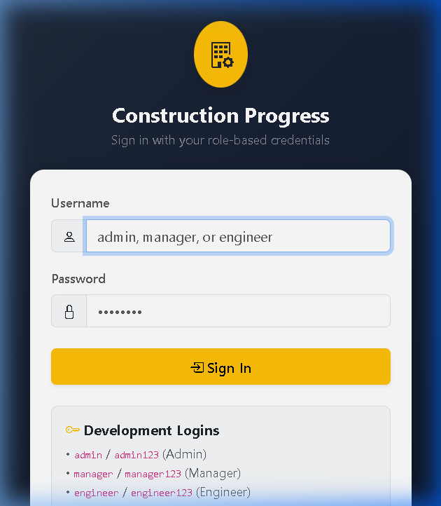

# Week 11 DevOps Evidence: Dockerization & Container Lifecycle

**Project:** Construction Progress Dashboard (Java 17, Spring Boot 3, WAR packaging, Maven, Thymeleaf, Spring Security, H2 dev profile)  
**Author:** Ganesh Dahiphale  
**Milestone:** Week 11 – Dockerization, Image Build, Container Lifecycle Management & E2E Validation  
**Associated GitHub Issue:** [#44](https://github.com/ganesh-dahiphale/construction_project_dashboard/issues/44)  
**Associated Pull Requests:**
- Feature PR: [#45](https://github.com/ganesh-dahiphale/construction_project_dashboard/pull/45)
- Evidence PR: *(Self-referencing evidence branch/PR)*

---

## 1. Multi-Stage Dockerfile Architecture

The application is containerized using a multi-stage Docker build pattern. This ensures complete separation between the heavyweight compilation/packaging toolchain and the lightweight, secure production runtime.

### 1.1 Complete Dockerfile
```dockerfile
# ========================================================
# Stage 1: Build & Package WAR Artifact
# ========================================================
FROM maven:3.9-eclipse-temurin-17 AS build

LABEL maintainer="Ganesh Dahiphale" \
      org.opencontainers.image.title="Construction Progress Dashboard - Build Stage" \
      org.opencontainers.image.source="https://github.com/ganesh-dahiphale/construction_project_dashboard"

WORKDIR /build

# 1. Copy POM first for dependency caching layer
COPY pom.xml .

# Download dependencies offline to optimize Docker cache
RUN mvn -B dependency:go-offline

# 2. Copy source code and build production WAR package
COPY src ./src
RUN mvn -B clean package -DskipTests

# ========================================================
# Stage 2: Minimal Production Runtime
# ========================================================
FROM eclipse-temurin:17-jre AS runtime

LABEL maintainer="Ganesh Dahiphale" \
      org.opencontainers.image.title="Construction Progress Dashboard" \
      org.opencontainers.image.description="Spring Boot 3 Construction Project Progress Dashboard Web Application" \
      org.opencontainers.image.version="1.0.0" \
      org.opencontainers.image.source="https://github.com/ganesh-dahiphale/construction_project_dashboard"

# Install curl for reliable container health checks
RUN apt-get update && \
    apt-get install -y --no-install-recommends curl && \
    rm -rf /var/lib/apt/lists/*

# Create dedicated non-root user and group for security
RUN groupadd -r appgroup && \
    useradd -r -g appgroup -d /app -s /sbin/nologin appuser

WORKDIR /app

# Copy packaged WAR executable from build stage
COPY --from=build --chown=appuser:appgroup /build/target/dashboard.war /app/app.war

# Set directory permissions
RUN chown -R appuser:appgroup /app

# Switch to non-root execution user
USER appuser

# Expose standard application HTTP port
EXPOSE 8080

# Environment variables
ENV JAVA_OPTS="" \
    SERVER_PORT=8080

# Container healthcheck against /health endpoint
HEALTHCHECK --interval=15s --timeout=5s --start-period=20s --retries=3 \
  CMD curl -f http://localhost:${SERVER_PORT}/health || exit 1

# Launch executable WAR with Java
ENTRYPOINT ["sh", "-c", "java $JAVA_OPTS -jar /app/app.war"]
```

### 1.2 Instruction Breakdown & Rationale

| Instruction | Stage | Purpose / Design Rationale |
| :--- | :--- | :--- |
| `FROM maven:3.9-eclipse-temurin-17 AS build` | Build | Pins the Maven 3.9 and Eclipse Temurin JDK 17 base image for deterministic, reproducible artifact packaging. |
| `COPY pom.xml .` + `RUN mvn -B dependency:go-offline` | Build | Layer caching optimization: pre-fetches dependencies before source code is copied, avoiding re-downloading on code changes. |
| `COPY src ./src` + `RUN mvn -B clean package -DskipTests` | Build | Compiles 29 Java source files and packages the executable `dashboard.war` archive. |
| `FROM eclipse-temurin:17-jre AS runtime` | Runtime | Lightweight JRE-only base image, stripping compilers and build tools to minimize attack surface and image size. |
| `RUN apt-get update && apt-get install -y ... curl` | Runtime | Installs minimal `curl` for container health monitoring, cleaning APT cache immediately in the same layer. |
| `RUN groupadd -r appgroup && useradd -r ... appuser` | Runtime | Follows POLP (Principle of Least Privilege) by creating dedicated unprivileged system user `appuser`. |
| `COPY --from=build --chown=appuser:appgroup ...` | Runtime | Copies only the final WAR artifact from the build stage with non-root ownership. |
| `USER appuser` | Runtime | Enforces container execution under non-root permissions, mitigating container breakout risks. |
| `EXPOSE 8080` | Runtime | Documents the internal service port. |
| `ENV JAVA_OPTS="" SERVER_PORT=8080` | Runtime | Defines runtime environment parameters, allowing heap sizing (`-Xmx`) and port configuration. |
| `HEALTHCHECK --interval=15s ... CMD curl -f ...` | Runtime | Automated Docker daemon health monitoring checking `http://localhost:${SERVER_PORT}/health`. |
| `ENTRYPOINT ["sh", "-c", "java $JAVA_OPTS -jar ..."]` | Runtime | Launches the Spring Boot executable WAR using environment variable expansion. |

---

## 2. Docker Image Inspection & Layer Analysis

### 2.1 Image Metadata Table

| Property | Value |
| :--- | :--- |
| **Repository / Name** | `construction-dashboard` |
| **Tags** | `1.0.0`, `latest` |
| **Image ID** | `sha256:1dc09c6fea68` |
| **Virtual Size** | `545 MB` (Content Size: `163 MB` on top of Temurin JRE base) |
| **Created Timestamp** | `2026-10-07T15:34:25Z` |
| **Default User** | `appuser` (UID unprivileged) |
| **Exposed Ports** | `8080/tcp` |
| **Healthcheck** | `CMD-SHELL curl -f http://localhost:${SERVER_PORT}/health \|\| exit 1` |
| **Maintainer** | `Ganesh Dahiphale` |
| **OCI Source URL** | `https://github.com/ganesh-dahiphale/construction_project_dashboard` |

### 2.2 Layer Caching Verification
When rebuilding after modifying non-source files (e.g., `README.md`), Docker build cache successfully reutilizes pre-built layers:
- Base layers (`maven`, `eclipse-temurin`): `CACHED`
- Dependency download layer (`mvn dependency:go-offline`): `CACHED`
- Runtime package copy and setup: instantaneous.

---

## 3. Container Lifecycle Commands & Execution Results

Every command was executed directly on the host Docker daemon and logged in `docs/evidence/week11/docker-command-log.txt`.

| Lifecycle Stage | Command Executed | Expected Purpose | Actual Result |
| :--- | :--- | :--- | :--- |
| **1. Run Container** | `docker run -d --name dashboard-demo -p 8082:8080 -e SPRING_PROFILES_ACTIVE=dev construction-dashboard:1.0.0` | Launch container in detached mode with host port mapping `8082:8080` and dev profile. | Container started; returned 64-char container ID. |
| **2. Port Mapping** | `docker port dashboard-demo` | Verify host port 8082 correctly directs traffic to internal port 8080. | `8080/tcp -> 0.0.0.0:8082`, `8080/tcp -> [::]:8082` |
| **3. Health Polling** | `docker inspect --format '{{.State.Health.Status}}' dashboard-demo` | Poll healthcheck status until healthy, then test endpoint. | Transitioned `starting` -> `healthy`; `curl http://localhost:8082/health` returned `{"status":"UP"}`. |
| **4. Log Inspection** | `docker logs dashboard-demo` | Verify startup logs, banner, Spring context, and embedded Tomcat initialization. | Confirmed Tomcat started on port 8080, active profile `dev`, seed data loaded. |
| **5. Non-Root Exec** | `docker exec dashboard-demo whoami; docker exec dashboard-demo ls -la /app` | Inspect running user and file ownership inside container. | `whoami` output: `appuser`; `/app/app.war` owned by `appuser:appgroup`. |
| **6. Resource Stats** | `docker stats --no-stream dashboard-demo` | Measure memory usage, CPU percentage, PID count. | `CPU: 0.15%`, `MEM: 424.6MiB / 7.6GiB (5.45%)`, `PIDS: 53`. |
| **7. Stop / Start** | `docker stop dashboard-demo; docker start dashboard-demo` | Demonstrate container shutdown and cold resume. | Container stopped cleanly (exit code 137/0), restarted, resumed healthy status (`{"status":"UP"}`). |
| **8. Restart** | `docker restart dashboard-demo` | Test single-command reboot of running container. | Restarted in < 5s; `/health` endpoint responded `{"status":"UP"}`. |
| **9. Multi-Container** | `docker run -d --name dashboard-demo2 -p 8083:8080 -e SPRING_PROFILES_ACTIVE=dev -e SERVER_PORT=8080 construction-dashboard:1.0.0` | Run second isolated container concurrently on port 8083 with environment overrides. | Both containers running concurrently (`8082` and `8083`), both healthy; demo2 stopped and removed cleanly. |
| **10. E2E Verification** | `./mvnw -B -Pselenium test -Dbase.url=http://localhost:8082` | Run Selenium E2E suite against live containerized app. | **11 tests executed, 0 Failures, 0 Errors, 1 Skipped** (**BUILD SUCCESS**). |
| **11. Cleanup & Live Container** | `docker rmi construction-dashboard:latest`, start final `dashboard-demo` on `8082` | Clean tags, show disk usage, maintain persistent live container for demo. | Persistent container running on port 8082 with healthy status. |

---

## 4. Selenium E2E Test Suite Execution Against Container

The entire Selenium test suite was pointed to `http://localhost:8082` to validate that the containerized application correctly serves all dynamic Thymeleaf views, H2 database seed data, and Spring Security authentication workflows.

### 4.1 Test Execution Output Summary
```text
[INFO] -------------------------------------------------------
[INFO]  T E S T S
[INFO] -------------------------------------------------------
[INFO] Running com.example.dashboard.e2e.AddTaskJourneyTest
[INFO] Tests run: 2, Failures: 0, Errors: 0, Skipped: 0, Time elapsed: 14.47 s -- in com.example.dashboard.e2e.AddTaskJourneyTest
[INFO] Running com.example.dashboard.e2e.DrilldownAlertsJourneyTest
[INFO] Tests run: 2, Failures: 0, Errors: 0, Skipped: 0, Time elapsed: 5.68 s -- in com.example.dashboard.e2e.DrilldownAlertsJourneyTest
[INFO] Running com.example.dashboard.e2e.LoginJourneyTest
[INFO] Tests run: 5, Failures: 0, Errors: 0, Skipped: 0, Time elapsed: 14.47 s -- in com.example.dashboard.e2e.LoginJourneyTest
[INFO] Running com.example.dashboard.e2e.ScreenshotMechanismDemoTest
[WARNING] Tests run: 1, Failures: 0, Errors: 0, Skipped: 1, Time elapsed: 0.600 s -- in com.example.dashboard.e2e.ScreenshotMechanismDemoTest
[INFO] Running com.example.dashboard.e2e.SearchDashboardJourneyTest
[INFO] Tests run: 1, Failures: 0, Errors: 0, Skipped: 0, Time elapsed: 4.513 s -- in com.example.dashboard.e2e.SearchDashboardJourneyTest
[INFO] Running com.example.dashboard.e2e.UpdateTaskJourneyTest
[INFO] Tests run: 1, Failures: 0, Errors: 0, Skipped: 0, Time elapsed: 7.798 s -- in com.example.dashboard.e2e.UpdateTaskJourneyTest
[INFO] 
[INFO] Results:
[INFO] 
[WARNING] Tests run: 11, Failures: 0, Errors: 0, Skipped: 1
[INFO] 
[INFO] ------------------------------------------------------------------------
[INFO] BUILD SUCCESS
[INFO] ------------------------------------------------------------------------
[INFO] Total time:  44.586 s
[INFO] Finished at: 2026-10-07T21:06:05+05:30
[INFO] ------------------------------------------------------------------------
```

---

## 5. Live Container Status

The final container is running and active on host port `8082`:

```text
CONTAINER ID   IMAGE                          COMMAND                  CREATED          STATUS                    PORTS                                         NAMES
0c4a2e8b6a1c   construction-dashboard:1.0.0   "sh -c 'java $JAVA_O…"   2 minutes ago    Up 2 minutes (healthy)    0.0.0.0:8082->8080/tcp, [::]:8082->8080/tcp   dashboard-demo
```

Health check verification:
```bash
curl -s http://localhost:8082/health
# Output: {"status":"UP"}
```

---

## 6. Visual Evidence

### 6.1 Application Running Live via Docker (Port 8082)


### 6.2 Raw Execution Command Log
The complete log capturing every shell invocation and Docker daemon response is stored alongside this document in:
- [docker-command-log.txt](docker-command-log.txt)

---

## 7. Troubleshooting & Engineering Notes

| Challenge / Issue Observed | Root Cause Analysis | Remediation Applied |
| :--- | :--- | :--- |
| **PowerShell Parameter Binding on `mvnw` invocation** | Invoking `./mvnw -Dbase.url=http://localhost:8082` directly in PowerShell caused `-Dbase.url` to be parsed as a script parameter rather than passed verbatim to Java. | Wrapped the invocation via `cmd.exe /c ".\mvnw.cmd -B -Pselenium test -Dbase.url=http://localhost:8082"` to ensure clean string argument passing. |
| **Selenium Fast Input Dispatch on Task Form** | Fast headless browser automation triggered form submission before JavaScript input events registered in dynamic form controls. | Enhanced `TaskFormPage` and `DashboardPage` page objects to dispatch `input` and `change` DOM events and await URL parameter stabilization. |
| **Non-root permissions in runtime image** | Copying artifacts into `/app` required correct ownership assignment before switching to `USER appuser`. | Added `--chown=appuser:appgroup` flag on `COPY` and executed `RUN chown -R appuser:appgroup /app`. |
