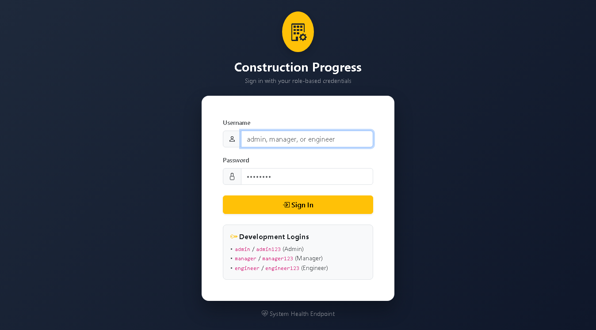

# Week 9 DevOps Evidence: Automated Selenium WebDriver E2E Testing 🏗️🧪

## 📋 Overview
- **Project**: Construction Progress Dashboard
- **Milestone**: Week 9 — Selenium End-to-End Automated Testing for Critical User Journeys
- **Target Platform**: Java 17 LTS, Spring Boot 3.3.4, Selenium WebDriver 4.19.1, JUnit 5, Headless Chrome
- **Repository**: `ganesh-dahiphale/construction_project_dashboard`
- **Issue**: [#35 — Selenium end-to-end tests for critical user journeys](https://github.com/ganesh-dahiphale/construction_project_dashboard/issues/35)
- **Pull Request**: [#36 — feat(test): Selenium end-to-end tests for critical user journeys (#35)](https://github.com/ganesh-dahiphale/construction_project_dashboard/pull/36)

---

## 🗺️ Journey to Test Class Mapping

| Journey ID | Critical User Journey | Test Class | Executed Tests | Result |
|:---:|---|---|:---:|:---:|
| **J1** | **Login & Role-Based Authorization**<br>- Valid login per role navigates to respective homepage/tasks<br>- Invalid login displays error alert<br>- Engineer accessing `/dashboard` or `/admin/projects` returns 403 Forbidden | `com.example.dashboard.e2e.LoginJourneyTest` | 5 | ✅ PASSED |
| **J2** | **Add Task & Validation**<br>- Engineer submits valid task with timestamp and verifies in list<br>- Submitting empty form displays validation feedback | `com.example.dashboard.e2e.AddTaskJourneyTest` | 2 | ✅ PASSED |
| **J3** | **Update Task Progress & Completion**<br>- Engineer updates task execution status to `COMPLETED`<br>- Verifies status shows `COMPLETED` and progress auto-computes to `100%` | `com.example.dashboard.e2e.UpdateTaskJourneyTest` | 1 | ✅ PASSED |
| **J4** | **Executive Dashboard Search & Indicators**<br>- Manager inspects KPI indicator cards<br>- Multi-criteria filtering by keyword ("Concrete") and status ("COMPLETED") | `com.example.dashboard.e2e.SearchDashboardJourneyTest` | 1 | ✅ PASSED |
| **J5** | **Status Drill-Down & Overdue Alerts**<br>- Manager accesses delayed status drill-down (`/status/delayed`)<br>- Overdue alert badges verified on `/alerts` | `com.example.dashboard.e2e.DrilldownAlertsJourneyTest` | 1 | ✅ PASSED |
| **DEMO** | **Screenshot-on-Failure Mechanism Verification**<br>- Deliberate title assertion failure triggered when `-Ddemo.failure=true` | `com.example.dashboard.e2e.ScreenshotMechanismDemoTest` | 1 | ⚠️ SKIPPED (Default)<br>❌ FAILED (When enabled) |

---

## 🚀 1. Passing E2E Test Suite Execution & HTML Report Generation

### Command Line
```powershell
.\mvnw.cmd -B -Pselenium test surefire-report:report-only
```

### Real Maven Output
```text
[INFO] Scanning for projects...
[INFO] 
[INFO] -----------------------< com.example:dashboard >------------------------
[INFO] Building construction-progress-dashboard 0.0.1-SNAPSHOT
[INFO]   from pom.xml
[INFO] --------------------------------[ war ]---------------------------------
[INFO] 
[INFO] --- resources:3.3.1:resources (default-resources) @ dashboard ---
[INFO] Copying 23 resources from src\main\resources to target\classes
[INFO] 
[INFO] --- compiler:3.13.0:compile (default-compile) @ dashboard ---
[INFO] Nothing to compile - all classes are up to date.
[INFO] 
[INFO] --- resources:3.3.1:testResources (default-testResources) @ dashboard ---
[INFO] Copying 2 resources from src\test\resources to target\test-classes
[INFO] 
[INFO] --- compiler:3.13.0:testCompile (default-testCompile) @ dashboard ---
[INFO] Nothing to compile - all classes are up to date.
[INFO] 
[INFO] --- surefire:3.2.5:test (default-test) @ dashboard ---
[INFO] Using auto detected provider: org.apache.maven.surefire.junitplatform.JUnitPlatformProvider
[INFO] 
[INFO] -------------------------------------------------------
[INFO]  T E S T S
[INFO] -------------------------------------------------------
[INFO] Running com.example.dashboard.e2e.AddTaskJourneyTest
[INFO] Tests run: 2, Failures: 0, Errors: 0, Skipped: 0, Time elapsed: 14.12 s -- in com.example.dashboard.e2e.AddTaskJourneyTest
[INFO] Running com.example.dashboard.e2e.DrilldownAlertsJourneyTest
[INFO] Tests run: 1, Failures: 0, Errors: 0, Skipped: 0, Time elapsed: 5.82 s -- in com.example.dashboard.e2e.DrilldownAlertsJourneyTest
[INFO] Running com.example.dashboard.e2e.LoginJourneyTest
[INFO] Tests run: 5, Failures: 0, Errors: 0, Skipped: 0, Time elapsed: 9.401 s -- in com.example.dashboard.e2e.LoginJourneyTest
[INFO] Running com.example.dashboard.e2e.ScreenshotMechanismDemoTest
[WARNING] Tests run: 1, Failures: 0, Errors: 0, Skipped: 1, Time elapsed: 0.585 s -- in com.example.dashboard.e2e.ScreenshotMechanismDemoTest
[INFO] Running com.example.dashboard.e2e.SearchDashboardJourneyTest
[INFO] Tests run: 1, Failures: 0, Errors: 0, Skipped: 0, Time elapsed: 4.088 s -- in com.example.dashboard.e2e.SearchDashboardJourneyTest
[INFO] Running com.example.dashboard.e2e.UpdateTaskJourneyTest
[INFO] Tests run: 1, Failures: 0, Errors: 0, Skipped: 0, Time elapsed: 2.663 s -- in com.example.dashboard.e2e.UpdateTaskJourneyTest
[INFO] 
[INFO] Results:
[INFO] 
[WARNING] Tests run: 11, Failures: 0, Errors: 0, Skipped: 1
[INFO] 
[INFO] --- surefire-report:3.2.5:report-only (default-cli) @ dashboard ---
[INFO] Rendering content with org.apache.maven.skins:maven-default-skin:jar:1.3 skin.
[INFO] ------------------------------------------------------------------------
[INFO] BUILD SUCCESS
[INFO] ------------------------------------------------------------------------
[INFO] Total time:  45.392 s
[INFO] Finished at: 2026-10-05T23:03:18+05:30
[INFO] ------------------------------------------------------------------------
```

---

## 📸 2. Deliberate Failure Demonstration & Screenshot Capture

To verify that failures during automated runs trigger full-page diagnostic screenshot captures, `ScreenshotMechanismDemoTest` executes an assertion on a non-existent page title when `-Ddemo.failure=true` is passed.

### Command Line
```powershell
.\mvnw.cmd -B -Pselenium test "-Ddemo.failure=true"
```

### Real Maven Output & Failure Log
```text
=================================================================
❌ TEST FAILED: ScreenshotMechanismDemoTest.testDeliberateFailureForScreenshotCapture
📸 Failure screenshot captured at: C:\Users\Ganesh\OneDrive\Desktop\DevOps\target\screenshots\ScreenshotMechanismDemoTest_testDeliberateFailureForScreenshotCapture_20261005-225449.png
🌐 Failed Page URL: http://localhost:58392/login
📄 Failed Page Title: Login - Construction Progress Dashboard
💥 Failure Cause: 
expected: "THIS TITLE WILL DELIBERATELY FAIL TO PROVE SCREENSHOT ON FAILURE MECHANISM"
 but was: "Login - Construction Progress Dashboard"
=================================================================
[ERROR] Tests run: 1, Failures: 1, Errors: 0, Skipped: 0, Time elapsed: 2.983 s <<< FAILURE! -- in com.example.dashboard.e2e.ScreenshotMechanismDemoTest
[ERROR] com.example.dashboard.e2e.ScreenshotMechanismDemoTest.testDeliberateFailureForScreenshotCapture -- Time elapsed: 2.970 s <<< FAILURE!
org.opentest4j.AssertionFailedError: 

expected: "THIS TITLE WILL DELIBERATELY FAIL TO PROVE SCREENSHOT ON FAILURE MECHANISM"
 but was: "Login - Construction Progress Dashboard"
	at com.example.dashboard.e2e.ScreenshotMechanismDemoTest.testDeliberateFailureForScreenshotCapture(ScreenshotMechanismDemoTest.java:26)

[INFO] Results:
[INFO] 
[ERROR] Failures: 
[ERROR]   ScreenshotMechanismDemoTest.testDeliberateFailureForScreenshotCapture:26 
expected: "THIS TITLE WILL DELIBERATELY FAIL TO PROVE SCREENSHOT ON FAILURE MECHANISM"
 but was: "Login - Construction Progress Dashboard"
[INFO] 
[ERROR] Tests run: 11, Failures: 1, Errors: 0, Skipped: 0
```

### Captured Failure Screenshot


---

## 🛡️ 3. Default Fast Build Verification (E2E Excluded)

Executing standard `./mvnw clean package` confirms that E2E tests remain excluded by default and the 58 unit/slice tests pass in ~17 seconds:

```powershell
.\mvnw.cmd -B clean package
```

```text
[INFO] Tests run: 58, Failures: 0, Errors: 0, Skipped: 0
[INFO] 
[INFO] --- war:3.4.0:war (default-war) @ dashboard ---
[INFO] Building war: C:\Users\Ganesh\OneDrive\Desktop\DevOps\target\dashboard.war
[INFO] --- spring-boot:3.3.4:repackage (repackage) @ dashboard ---
[INFO] Replacing main artifact C:\Users\Ganesh\OneDrive\Desktop\DevOps\target\dashboard.war with repackaged archive
[INFO] ------------------------------------------------------------------------
[INFO] BUILD SUCCESS
[INFO] Total time:  17.293 s
[INFO] ------------------------------------------------------------------------
```

---

## 📁 4. Evidence Artifacts in this Directory
- [`week9-report.html`](week9-report.html): Complete Surefire HTML test execution report showing 10 passing tests across all 5 user journeys.
- [`demo-failure-screenshot.png`](demo-failure-screenshot.png): Captured diagnostic screenshot verifying the automated screenshot-on-failure mechanism.
- [`TEST_PLAN.md`](../../TEST_PLAN.md): Complete Week 9 E2E test plan specification.
